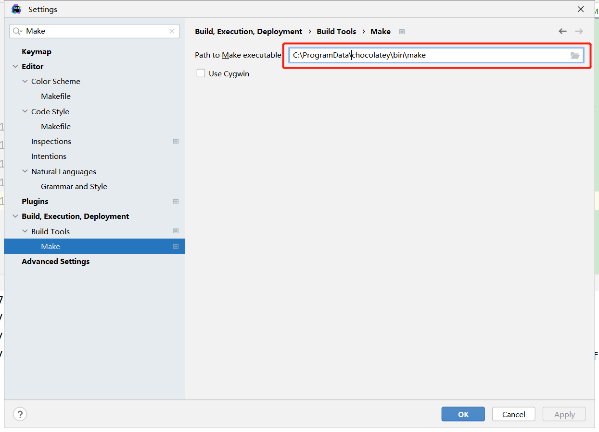

1.go install github.com/go-micro/cli/cmd/go-micro@latest
or go install github.com/go-micro/cli/cmd/go-micro@v1.1.4

2.go-micro new service first

3.下载 protoc  https://github.com/protocolbuffers/protobuf/releases
配置环境变量

4.powshell中输入 Set-ExecutionPolicy Bypass -Scope Process -Force; iex ((New-Object System.Net.WebClient).DownloadString('https://chocolatey.org/install.ps1'))

5.choco install make

6.goland配置make
